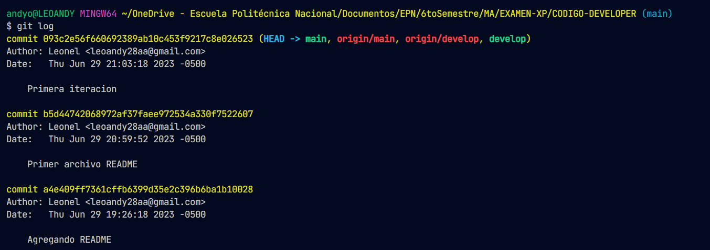
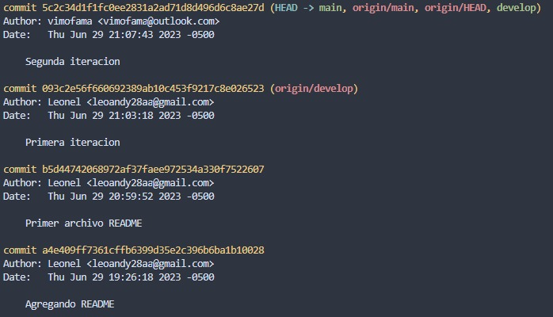

# REPOSITORIO DE GITHUB

Enlace al [repositorio](https://github.com/leoandy23/TraductorKichwa)

# COLABORADORES

- [Mateo Morales - Pablo](https://github.com/vimofama)
- [Andy Otavalo - Tyron](https://github.com/leoandy23)

# RAMAS

## RAMA MAIN

- Rama principal del proyecto

## RAMA DEVELOP

- Rama de desarrollo

## PRIMERA ITERACION

## SEGUNDA ITERACION

## Estadisticas GitHub

