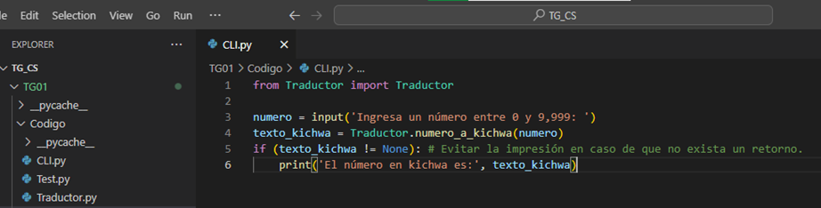
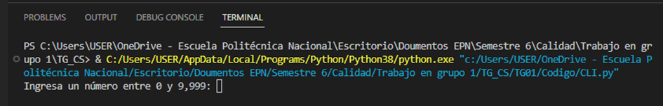
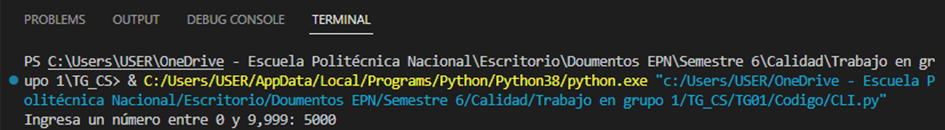
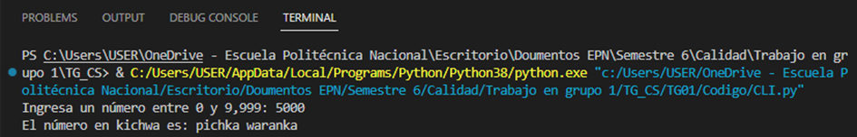

# Manual de Usuario

# Convertidor de Numeros a Kichwa

## 1. Introduccion

El Convertidor de Números a Kichwa es una aplicación que permite convertir números del rango de 0 a 9,999 al idioma kichwa, un idioma indígena hablado en algunas regiones de los Andes en Ecuador. Este manual proporciona instrucciones detalladas sobre cómo utilizar la aplicación y aprovechar al máximo sus funcionalidades.

## 2. Audiencia objetivo

Representaría a este programa aquellos que estén interesados en la traducción de números al idioma kichwa, una lengua indígena hablada en los Andes de Ecuador. El programa está diseñado para ser utilizado por personas que deseen convertir números del sistema decimal al sistema de numeración kichwa. Por lo tanto, los usuarios potenciales serían aquellos que estén estudiando el idioma kichwa, que necesiten utilizarlo en contextos específicos o que tengan interés en explorar otras formas de representar numéricamente las cantidades.

## 3. Requisitos del Sistema

### 3.1. Python (versión 3.8 o superior)

### 3.2. Consola o entorno de ejecución de Python

## 4. Instalación

- La aplicación puede ser ejecutada sin necesidad de realizar instalaciones adicionales. No obstante, es importante verificar que Python esté instalado en su sistema, junto con las configuraciones previas del entorno de desarrollo integrado (IDE).

## 5. Ejecución

Para ejecutar la aplicación, siga estos pasos:

### 5.1. Abra el IDE o entorno de ejecución de Python.

Figura 1: Entorno de desarrollo integrado

### 5.2. Copie y pegue el código proporcionado en el entorno de ejecución.

Figura 2: Programa - Convertidor de números a Kichwa

### 5.3. Ejecute el codigo

Figura 3: Ejecucion terminal

### 5.4. Ingrese un numro entre 0 y 9999 cuando se solicite

Figura 4: Ingresar un numero

### 5.5. El programa mostrara el numero convertido al idioma kichwa

Figura 5: Resultado

## 6. Funcionalidades

El Convertidor de Números a Kichwa ofrece las siguientes funcionalidades:

### 6.1. Convierte números del rango de 0 a 9,999 al idioma kichwa.

### 6.2. Proporciona la traducción en una estructura de palabras compuestas que sigue las reglas gramaticales del idioma.

## 7. Consideraciones

### 7.1. Asegúrese de ingresar un número válido dentro del rango especificado (0 a 9,999). La aplicación no maneja números fuera de este rango y puede generar resultados inesperados o errores.

### 7.2. Tenga en cuenta que el idioma kichwa tiene reglas gramaticales específicas para la formación de palabras compuestas. El resultado mostrado seguirá estas reglas y puede incluir varias palabras según la estructura del número ingresado.

## 8. Limitaciones

- La aplicación actualmente solo admite la conversión de números del rango de 0 a 9,999 al idioma kichwa. No es compatible con números fuera de este rango.

## 9. Solución de problemas

- Si experimenta algún problema durante la ejecución de la aplicación, verifique que tenga Python instalado correctamente y que esté utilizando la versión adecuada.
- Si encuentra errores o comportamientos inesperados, asegúrese de ingresar números válidos dentro del rango especificado.

## 10. Contacto y Soporte

- Para cualquier consulta, problema o sugerencia relacionada con la aplicación, puede ponerse en contacto con nuestro equipo de soporte a través del correo electrónico backyardigans@epn.com

¡Disfrute utilizando el Convertidor de Números a Kichwa y experimente con la riqueza del idioma kichwa en la representación de números!
